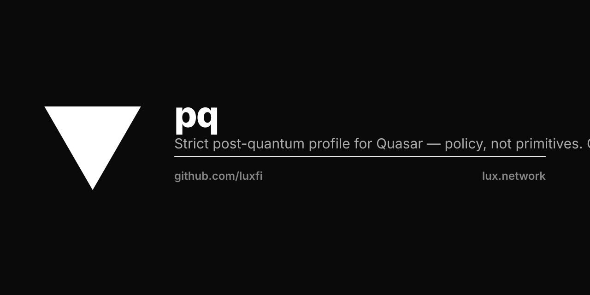

<p align="center"></p>

# pq

`pq` defines the strict post-quantum profile that constrains which
cryptographic operations a Quasar node accepts.

The package contains no cryptographic primitives. It expresses a
policy.

## Model

- `Profile` is the value. Eight `Forbid*` flags, one per cryptographic
  primitive family. `nil` and the zero value both mean classical
  semantics; `Strict()` sets every flag true.
- `Op` is the operation a precompile or signer reports. Sixteen stable
  identifiers cover the EVM precompile families plus polynomial
  commitments.
- `Refuse` is the gate. Every constrained operation calls it once at
  the top of its entry point and otherwise proceeds in its own lane.

Policy and enforcement are decomplected. The profile does not know how
the operations compute; the operations do not know how the profile is
selected.

## Use

```go
import "github.com/luxfi/pq"

// Bind once at chain bootstrap.
pq.SetActive(pq.Strict())

// Every constrained primitive.
if err := pq.Refuse(pq.OpEcrecover); err != nil {
    return nil, err
}
```

## Presets

| Preset | Constructor | Effect |
|---|---|---|
| Strict | `pq.Strict()` | Forbids every primitive family. |
| Permissive | `pq.Permissive()` | Admits every operation (zero value also works). |

## Primitive families

| `Forbid*` flag | EVM addresses | Op constants |
|---|---|---|
| `ForbidEcrecover` | `0x01` | `OpEcrecover` |
| `ForbidP256Verify` | `0x100` (RIP-7212) | `OpP256Verify` |
| `ForbidSHA256` | `0x02` | `OpSHA256` |
| `ForbidRIPEMD160` | `0x03` | `OpRIPEMD160` |
| `ForbidBlake2F` | `0x09` | `OpBlake2F` |
| `ForbidBn256` | `0x06`, `0x07`, `0x08` | `OpBn256Add`, `OpBn256ScalarMul`, `OpBn256Pairing` |
| `ForbidBLS12381` | `0x0b`–`0x11` (EIP-2537) | `OpBLS12381*` (seven) |
| `ForbidKZG` | `0x0a` (Cancun) | `OpKZGPointEval` |

Each family has a matching `Err*Forbidden` error so dashboards and
replay tools attribute violations to the right family.

## Environment

`QUASAR_STRICT_PQ=1` selects Strict via `FromEnv`. Mainnet binaries set
this in their entrypoint.

## Versioning

The canonical encoding is versioned. The current version is 2.
Renaming or reordering fields requires a version bump and a
consensus-level upgrade.

The strict and permissive profile hashes are pinned in `pq_test.go`.
A change to either is consensus-breaking.

```
strict:     9efdbf424085b0557866c22b0a4e0c48e2ed90c8c9e3f699d17a3e0783cb2128
permissive: 256f4daa37543549e06bd101aab7f21a9b9dff46d322a9392e6b035cf4f0f638
```

## Tests

```
go test ./... -count=1
```
